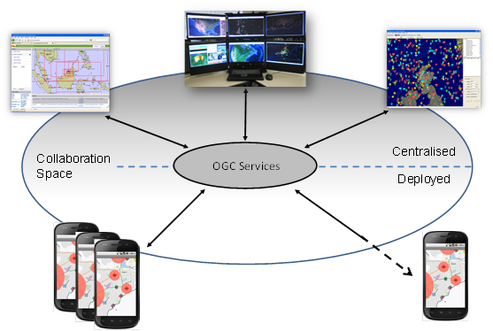
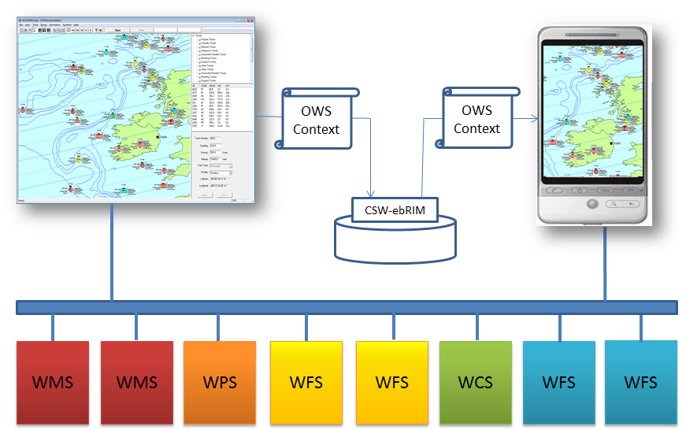
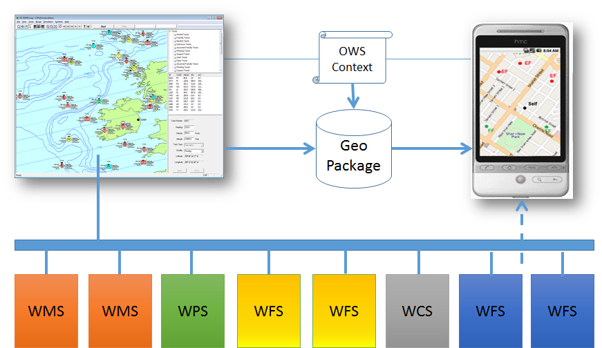

== Common Use Cases

The Context Document goal is to support the exchange of a set of information elements between human users or application programs for a range of purposes such that the Area of Interest,
time range, resources and their configuration is unambiguously exchanged between applications.

=== Use Cases 

The OWS Context document is aimed at meeting a range of user context exchange requirements around sharing information. This section provides more detail on the primary use cases described in section 1 including a definition ofcommon sub use-cases.

==== Shared Situational Awareness/COP Exchange

Users in a range of environments have access to the central services, but typically wish to collaborate using a shared set of information of information. In a collaboration built on for example an emergency response there is typically a wide range of stakeholders and a need to provide them with relevant common information. Often one person or group (typically geo-support) has the responsibility to provide a set of information to other users (in this case commanders and on-scene responders) in time sensitive situations to allow them to deal with the evolving situation; given that they do not have time to assemble information themselves. The OWS Context Document standard allows the geo-support personnel to assemble a set of relevant information, accessible via web services, and pass it to other users (by email message, file transfer or by storing it within an OGC catalogue).

===== On-Line COP Use Case

The exchange of a common operating picture or view of information is recognized as one of the most important uses of the OWS Context Document. Often a COP defines a geographic Area of Interest and a set of information layers and queries to specific points of interest. The content of a COP may be made up of both web services and local content, and the OWS Context document allows this to be supported. It also allows the inclusion of alternatives for a given layers. 

A critical element of a shared situational awareness environment, whether used in a military, civil incident management or any other situational awareness context is the ability to exchange COPs between systems based on different technology. There are many equivilent approaches to OWS Context, but none which offer a vendor agnostic approach. This hetrogeneous model means COPs can be shared in a number of environments, for example between command centers and deployed users in vehicles or on foot, and using everything from laptops in mobile vehicles through to tablets, mobile devices or wearable technology (see figure 2.1). 

*Figure 2.1 - OWS Context SSA Use Case*

A COP may take many forms and have many uses, it may represent a 2D map display, a 3D map display, an augmented reality view, or a textual representation of geospatial information.  

The COP exchanged is not simply a graphic but a 'live' view. When loaded it should show the latest state of the information referenced. This is a capability of OWS Context. 

In this basic COP use case, OWS Contexts are simply exchanged between systems using a file system or via a messaging system such as email. More advanced exchanges are possible via a catalogue where users can identify groups of context documents relevant to them directly or incidentially. In addition it is possible that users could be notified on new contexts using a subscription scheme (potentially based on the OGC PubSub Standard).

image::images/Figure2_2.png[] 
*Figure 2.2 - OWS Context SSA Use Case*

===== On-Line COP Exchange Via Catalogue

OGC Compliant catalogue services provide a useful way to manage OWS Context Documents. 

*Figure 2.3 - OWS Context Catalogue Storage Use Case*

===== Off-Line COP Exchange

As part of this there is the recognition that in some cases the services referenced may not be available, and therefore some information (for example overlays or thumbnails) may need to be carried in the context document itself or alongside it. The context document layers may need to support both an on-line and an off-line alternative. One delivery model for a range of geospatial information is the GeoPackage standard. One specific model is to use the OWS Context document to provide a defintion of the services to be harvested into a GeoPackage so that the content can then be used off-line. Either a WPS service (GeoPackager) or the client itself can use the context document to load the GeoPackage with data and potentially update a GeoPackage which was already created. The context document allows the layers (WMS or WMTS) and feature types (WFS) required to be defined but also the geo-extent of data to be harvested. 

Of course GeoPackage is not the only carrier encoding that could be used in this way, and evolving standards such as CDB [Ref 4] could potentially be created from an OWS Context defintion. Alternatively completely proprietary caches could be created on a client, once again using OWS Context to define the content of a cache. The attractive element of this overall workflow is that a client can see what will be cached using the normal on-line access, before executing the process to cache the data.

 
*Figure 2.4 - OWS Context Off-line Use Case*

==== Exchange of a Catalogue Query and Results

This use case relates to the exchange of discovery results from various catalogue searches, to avoid duplication of effort. In this case a user would execute one
or more searches and retain each search request and possibly results set and be
able to exchange the search and results set with others so that they could
review the results or modify and re-execute the search.  To do this primarily CSW requests and optionally results will be stored in the context document. This allows the retrieved results to be reviewed but also allows the query used to obtain the results to be re-run or modified and rerun. 

==== Exchange of the Configuration and Results of a Process

A user wishes to save and/or exchange the configuration and/or results of an analysis or processing activity. The process to be executed will be stored in the
context document as well as inline or referenced results. This type of context
document might use WPS to define the processing, with results returned by the
WPS, inline in the Context document in GML, in a referenced image, or available
via another OGC service (WMS, WMTS etc). 

=== Requirements 

The above use cases lead to the following general requirements for an OWS Context document. 

* The Context Document shall provide the capability to identify the temporal extent of the COP (one or more time envelopes). (See Chapter 5 - Time Interval of Interest Metadata)

* The Context Document shall provide the capability to define a series of configured resources together which provide relevant information to the COP User.
 (See Chapter 5 - Resources)

* The Context Document shall define the order of precedence of the resources included (this could be interpreted as, for example, the order of display by visualization clients)
(See Chapter 5 - Ordering of Resources)

* The Context Document shall allow any service type to be specified and any rules to be specified.
(See Chapter 5 - Offering)

* The Context Document shall provide information to allow clients to test if a service matches a supported profile in order 
to understand if they can interpret it. (See Chapter 5 - Telling if an XML/GeoJSON Document is a Context Document) 

* The Context Document shall allow information targeted at different representations to be included (i.e. not just targeted at geographic visualization or just visualization).
(See Chapter 6 - Terradue - Using OWS Context to store Searches)

* The Context Document shall allow information to be marked as enabled or disabled, i.e. it is to be presented to the user when the context is opened or isn’t. Source: WMC Specification: which has and on/off option (layer not displayed or not when loaded).
(See Chapter 5 - Visibility Attribute)

* It shall be possible to associate information with embedded graphics information. (See Chapter 5 - Content Offerings)

* The Context Document should allow the in-line inclusion of a resource (literal value of a resource) in the context document.
(See Chapter 5 - Content Offerings)

* The Context Document should allow the parameters which define the resource or processing service steps to be captured.
(See Chapter 5 - Envitia_TB12_OWC.xml and Envitia_TB12_OWC.json)
