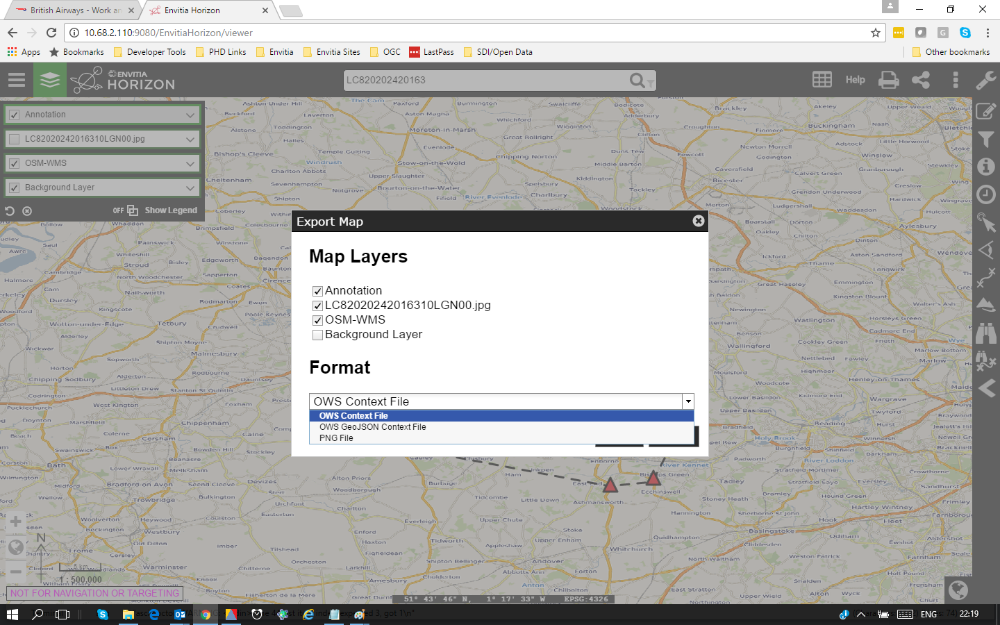
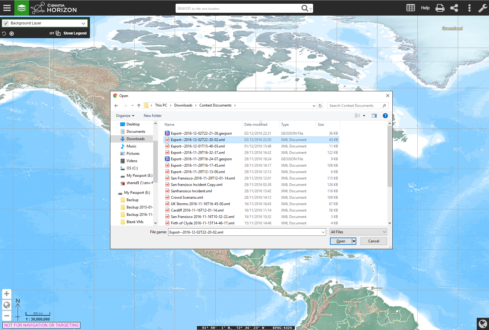
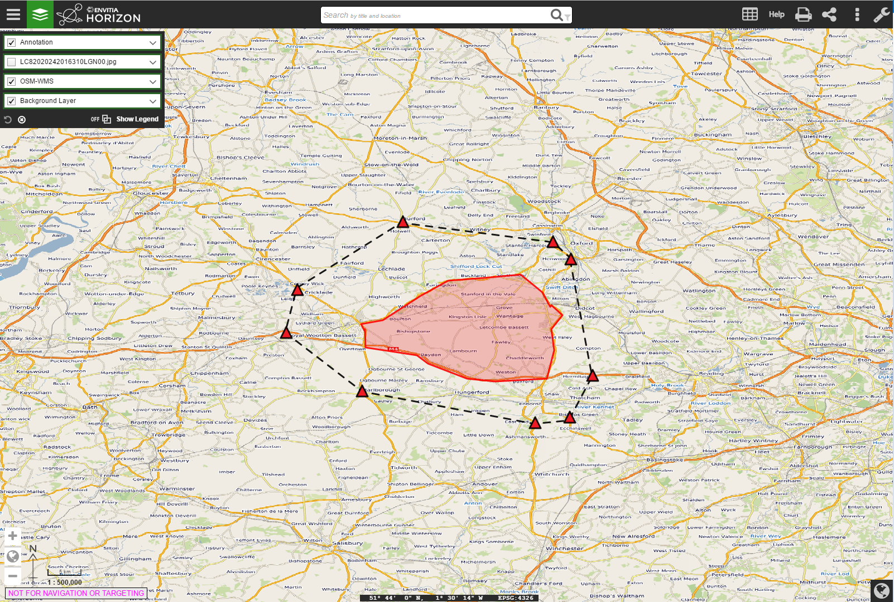

== OWS Context for Users

The goal of this section is to give end users of OWS Context documents and idea or how they can be used. To do this a two existing applications are exploited to show the typical workflow. As can be seen in section 6 (Applications and Tools) there are a number of other applications which support OWS context with a range of use cases, so the following example is purely one method of exploiting it.

The example in this section use the Envitia Horizon Web Client which was used during testbed 12. The functionality described is for guidance only. OWS Context does not mandate client behavior, and other implentors may design the functionality in a different way. 

=== Building the View to be Shared

Firstly the user uses a browser based client to create an OWS Context Document. This process follows a fairly normal GIS Workflow. 

==== Catalogue Search

The creation of most geospatial views begins with a discovery process. Typically geospatial information users define an area of interest, and categories of information they are interested and perform some form of search. The figure below shows an example of just such a search. In this case the user was looking for data in the area of ??? and after executing the search can see a range of data sources. 

image::images/Figure4_1.png[] 
*Figure 4.1 - Web Client Searching for Data*

==== Adding information from WMS Services.

Each returned dataset may be available as different service types. For example a rivers layer may be available via a WMS service or a WFS service. The user can see these various options in the Metadata and select to add one.As a shortcut, in this case the client gives the user a shortcut button to add the WMS if its present. The result is a layer added on top of the default background map in the client. This process is completed for a number of layers until the user is happy with the content. An example of this is shown in figure 4.2.

image::images/Figure4_2.png[]
*Figure 4.2 -Client Showing Two added Layers*

==== Setting Layer Visibility

It may be a large number of layers are included in a Context Document as the creator wishes to pass on to the client the best range of data available. But there is a desire to keep the view simple for the user recieving the document. A good way of providing a rich set of infomation but limiting the clutter, is to include a number of additional layers but set their visibility off. In the example in figure 4.2 the imagery layer (second from the top in the list to the left) is set to off and therefore the imagery is not visible. The context document will be exported with this setting. 

==== Adding Annotation

A common requirement is also to provide the receiving user with some annotation related to the view. In Horizon users have the ability to create as many annotation layers as they wish, but in this case we create a single one and add some annotation. 

image::images/Figure4_3.png[] 
*Figure 4.3 - Adding Annotation to the View*

==== Saving The Context Document

The next step is to Save the Document, Horizon includes the capability to save context documents. The user can envoke the 'Save Context' option and then the dialog is displayed. 

In the Horizon Client the context document can be saved to an OGC CSW-ebRIM compliant Catalogue service (also known as a Registry) or to the local file system on the client. 

image::images/Figure4_4.png[] 
*Figure 4.4 - Selecting Location to Save Context*

The dialog allows the layers loaded to be output in the Context Document. The layers in the client are listed and the user can pick which layers are included.

In addition the user can select whether an area of interest is set (this can be toggled or or off). If set the context will be output with a bounding box in the context document. The other key option in the dialog is the ability to select which encoding of OWS Context is used. The options are ATOM/XML and GeoJSON. The choice really depends on the level of support in the client the document will be sent to, i.e whether it supports the ATOM/XML or GeoJSON encoding.

*Figure 4.5 - Selecting Location to Save Context*

==== Exchanging the Context Document

OWS Context documents are simple text endcodings in either XML or JSON. As a result they can be sent as email attachments without zipping or converting them.

The recieving user can simply save the document to a local file system ready to be loaded.

==== Loading the Context Document

Envitia Horizon can then be used to read the OWS Context document. The user uses the load function in
the Web Client. Firstly the client is opened. 

image::images/Figure4_6.png[]
*Figure 4.6 - Open Envitia Horizon*

Th import function allows a document to be picked from the file system. 

*Figure 4.7 - Open Envitia Horizon*

When a file is selected and loaded the geographic display zooms to the relevant area and loads all layers selected as on. 

 
*Figure 4.8 - Context document loaded*

==== Creating a Revised Document

In this example we have been using the same client for both creator and reader. It is therefore possible to then modify the context document by using the catalogue to find and add more data or add additional annotations. A new context document can be created which includes the additional content. 
