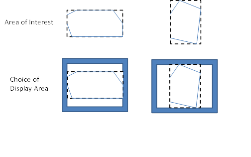

== OWS Context for Developers

The goal of this section is to provide guidence to developers on implementing OWS Context in applications. It addresses both reading and writing OWS Context documents.  The section outlines a typical workflow for applications showing common operating pictures (i.e. to exchange a view of information between multiple users), but other use cases are considered at the end of this chapter.

=== Reading OWS Context Documents

There are two encodings of OWS Context, an ATOM/XML encoding and a GeoJSON encoding (both are approved OGC standards, although the GeoJSON encoding is in the final stages of publication). This section addresses both encodings, highlighting differences where they exist.

==== General Syntax Rules

Before proceeding too far it is worth
noting a couple of things about the Context encodings.

===== ATOM/XML Encoding

*   The ATOM/XML encoding can be read by normal XML Parsers such as Xerces.
*   The encoding uses ATOM (a dialect of XML). This cannot be validated using an XML schema. The approach used for validation of ATOM is Relax NG. Do not try and perform schema validation. (Note a Relax NG Validator for OWS Context ATOM/XML is available on the OGC Team Engine, see section 6 for details)

*   The ATOM
     model allows for foreign content to be present in the document.  The implication of this is that a reader
     should not terminate when an element is encountered that it does not
     understand or expect. The element should simply be ignored.

===== GeoJSON Encoding

The GeoJSON encoding provides a JSON based alternative which is easily consumed by browser apps using JavaScript. It complies with the GeoJSON encoding model. In some cases minor limitations exist in this encoding and these are described where they occur. 

==== Telling if an XML Document is a Context Document

OWS Context documents use the standard extensions of .xml (for an ATOM/XML encoding) and .json or .geojson (for a GeoJSON Encoding). The method of determining if the document is an OWS Context document
is for an application to query the following elements inside the file.

===== ATOM/XML Encoding

For an ATOM/XML document XML tag at the top level (i.e directly under the
root element which will be ‘feed’) contains an atom link property:

[source,xml]
----
<atom:link
  rel="profile"
  href="http://www.opengis.net/spec/owc-atom/1.0/req/core" 
  title="This file is compliant with
  version 1.0 of OWS Context"/>
---- 

In particular the validation should verify
the existence of the link tag, and its attributes rel and href and their
values. The title is for information only.

If the document is in a catalogue, it is
also likely that the application can tell if it’s a context document from its
mime type which is:

===== GeoJSON Encoding

As with ATOM/XML, the document needs to be parsed and the element identifying a GeoJSON document as an OWS Context document is the 'profile' property on the overall FeatureCollection within the document, as shown below.

[source,json]
----
{
  "type": "FeatureCollection",
  "id": "http://www.opengis.net/owc/1.0/examples/geojson/1",
  "properties" : {
    "links" : {
    "profiles" : ["http://www.opengis.net/spec/owc-geojson/1.0/req/core"],
    ...
  },
  "features": [
    ...
    }]
  }
----

==== Mandatory Metadata

Aside from the above, the only other
mandatory items in a context document are:

*   <atom:language>
*   <atom:id>
*   <atom:title>
*   <atom:updated>

So an application can depend on these tags being present when scanning context documents and this is the minimum information that could be catalogued, listed or presented to the user. 

===== ATOM/XML Encoding

Wherever possible in the ATOM/XML encoding of OWS Context the atom element is used so that the document could be interpreted by an atom reader for wider interoperability. 

[source,xml]
----
<feed xmlns="http://www.w3.org/2005/Atom" xml:lang="en" >
<link rel="profile"
  href="http://www.opengis.net/spec/owc-atom/1.0/req/core"
  title="This file is compliant with version 1.0 of OGC Context"/>
  <id>https://portal.opengeospatial.org/twiki/bin/view/OWSContextswg/SpecAtomEncoding#1</id>
  <title>Context Example :: Algal Pigment</title>
  <updated>2012-02-21T11:58:23Z</updated>
<feed>
---- 

This is the minimum needed in an OWS Context document. It has no area of interest and no time range and it loads nothing, thus it is of little practical use but it is nevertheless a valid (and harmless) context document. There are valid reasons for such a 'null' document which relate to security and access control, thus it is allowed.  

===== GeoJSON Encoding

The equivilent GeoJSON encoding of this content is as follows:

----
"properties" : {
    "lang"    : "en",
    "title"   : "OWS Context GeoJSON Example",
    "updated" : "2012-11-04T17:26:23Z",
    ....
},
----

Note in the Atom encoding the language is captured in the 'feed' tag whereas in the GeoJSON Encoding it is within the 'properties' element.

==== Optional Metadata

The document has a number of other ‘metadata’ tags at the top level (abstract, author etc), but in particular there is a reference to ISO compliant metadata which is the most extensive information source.

===== ATOM/XML Encoding

----
<link rel="via" type="application/xml"
href="http://www.acme.com/collections/algal.xml" title="Algal XML metadata"/>
----

As well as this optional metadata, OWC provides a series of top level elements which are key metadata. As a quick note to writers of OWS Context, the information in these elements and in any referenced ISO metadata, if present should be consistent. The user of the context document should be able to depend on this and use either. The top level elements include:

•	atom:subtitle (an abstract for the document)
•	atom:author/atom:name  (author of the document)
•	dc:publisher (publisher, Dublin core Extension)
•	atom:generator (application used to create the context)
•	atom:rights (access rights. This field is not well defined).
•	atom:category/@term  (Keywords, multiple)

Each of these has a direct GeoJSON equivilent. See the specification for details.

===== GeoJSON Encoding

The GeoJSON Encoding of these elements is as properties under the 'FeatureCollection' element in GeoJSON. 

----
    "subtitle"         (an abstract for the document)
    "authors"          (author(s) of the document)
    "publisher"        (publisher of the document)
    "creator"          (application used to create the context)
    "rights"           (access rights. This field is not well defined).
    "categories.term"  (Keywords, multiple) 

----

As well as these attributes though there are two critical optional attributes which an application should interpret, these are area of interest and time interval. These are described below.

==== Area of Interest Metadata

A context document optionally contains an area of interest metadata item which is defined by an envelope encoded in georss form. 

===== ATOM/XML Encoding

In ATOM/XML this typically looks as follows:

[source,xml]
----
<georss:where>
    <gml:Polygon>
<gml:exterior>
 	    <gml:LinearRing>
<gml:posList srsDimension="2">-90 -180 90 -180 90 180 -90 180 -90 -180</gml:posList>
    </gml:LinearRing>
</gml:exterior>
    </gml:Polygon>
</georss:where>
----

Firstly, as this is georss [REF 5], this is specified in WGS-84 (implicit). Note that although the above draws a box the envelope can be any shape of non-intersecting polygon.

===== GeoJSON Encoding

[IMPORTANT]
====
In GeoJSON there is an issue, as a geometric primitive cannot be a FeatureCollection, it needs to be on a feature. This means a GeoJSON encodiing can only capture a bounding box AOI, not a polygonal one. 
====

An example of the equivilent GeoJSON Encoding for the above is shown below.

----
{
"type": "FeatureCollection",
  "id": "http://www.opengis.net/owc/1.0/examples/geojson/1",
  "properties" : {
    ....
    },
  "bbox": [-180,-90,180,90],
  "features": [{
    ...
----

In general converting an OWS Context document from ATOM/XML to GeoJSON or from GeoJSON to ATOM/XML is lossless, but in this one respect, complex bounding envelopes will be converted in a conversion from ATOM/XML to GeoJSON to rectangular bounding envelopes. 

====== Display Client Use the AoI of an OWS Context Document

The OWS Context document standard does not recommend any specific client action in relation to properties such as the Area of interest, but it is desirable that all clients represent the contents in a similar way as possible. The following is suggested behaviour which maximises the chances of commonality in interpretation of the context documents. Ultimately it may form best practice but should be considered at this stage simply suggested behaviour.  

*Suggestion 1:* If no bounding box is specified, do not change the current view when the context document is loaded. The merit of this is that a user can create a 'master' Context Document with the AOI and then a series of other themed OWS Context Documents which when loaded will supplement the content but wont change the AOI. 

*Suggestion 2:* If a bounding box is specified, but it is a different shape to the screen area of the client in which the OWC is to be displayed, perform a best fit, which ensures that the entire area of the AOI envelope is displayed. 

*Suggestion 3:* An alternative, if possible, would be to force the application's geo-view to fit the OWS Context document AOI Aspect ratio but this is often problematic. Because it is unlikely that the client window AOI is a different shape from the AOI in the context document. 

*Suggestion 4:* Some clients (particularly web clients) operate on fixed zoom values and so may not be able to exactly match the zoom level of an OWS Context document's AOI. The recommendation is, if this is the case, adopt the lower zoom (smaller scale) so that the entire AOI is displayed.   
 
*Suggestion 5:* The client could display the AOI in some way (say as a dotted box which can be turned on or off). This means the user can see what the intended AOI of the context document was.

 

 
*Figure 4 – Matching AOI to Display.*

There are of course options in terms of the behaviour. The application could ask the user if they want to zoom to the extent of the context document. Clients could also optionally display the extent of the context document as well as zooming to it. But the overall behavior should be that if the context document has an AOI the user should be able to centre on and zoom to it easily. 

There is also a potential issue with some browser based clients as these often have fixed zoom levels. So matching the zoom level in an OWS Context document to the zoom level options available in a browser client is always a little difficult.

[IMPORTANT]
====
So, from the above, it should be noted that it is not possible to exactly re-create the view in terms of AOI present on the screen that created an OWS Context document. A close approximation is possible but re-creating the exact area is challenging on hetrogeneous devices. 
====

The AOI is also not intended to provide metadata on the extent of the data present in the context document which may well extend outside of the AOI. It is providing a clear indication of what geographic area of interest is. 
The AOI is of course also valuable when searching for Context documents for a given operation or mission. As a result writers of context documents are encouraged to populate it.

==== Time Interval of Interest Metadata

This element also has an important role in a context document for some applications. Some of the data included in a context document may have a time range. This might include weather data or event based recording data. The Time Interval of Interest, like the area of interest, is not the time extent of the data, it is the time range  which is expected to be of interest to the user. So if a particular event (e.g. movement of a hurricane) has a range of times where something critical happens, the time interval would be set to that range. The interval specified should be compliant with an ISO DateTime interval.

===== Display Client use of Times and Time Intervals

Again, not part of the OWS Context standard but the suggested behavior of the client for time interval is to set the end stops of a time slider to the time range of interest. This is though quite advanced behavior and many clients will not support time range. This is only suggested behavior and the time range may be ignored.

==== Resources

Resources are the key element of an OWC document. They each reference a set of geospatial information to be treated as a  logical element. In display clients resources will be realized as ‘layers’ in typical display clients. The resources are ordered such that the first item in the document is to be displayed at the front.  Resources contain a large number of elements, these fall into several categories.

===== ATOM/XML Encoding

Within the ATOM/XML encoding resources are mapped to ATOM 'Entry' elements:

----
<feed xmlns="http://www.w3.org/2005/Atom" xml:lang="en">
...
<entry>
  <id>http://www.acme.eu/geoserver/wms/#world_countries</id>
...
</entry>
...
</feed>
----

===== GeoJSON encoding

Within the GeoJSON Encoding resources are mapped to GeoJSON Feature Elements.

----
{
  "type": "FeatureCollection",
  "id": "http://www.opengis.net/owc/1.0/examples/geojson/1",
  "properties": {
    ...
  },
  "features": [{
    "id" : "http://www.acme.eu/geoserver/wms/#world_countries”,
      ...
  }]
}
----

===== Ordering of Resources

Resources in an OWS Context document are ordered. Particularly for visualisation this defines the order in which layers are drawn. The reason for this is that it is often important for visualisation. If an OWS Context document references many layers, background map route data, a series of critical overlays etc, it is important that these are drawn in the right order. For both ATOM/XML and GeoJSON the draw order [yelow-background]#is# the back to the front.

[IMPORTANT]
====
A potential confusion in the standard is the draw order. It is easy to assume resources are drawn in the order they are read, but this is not true. The draw order for OWS Context Document Resources is from last to first. This is true for both ATOM/XML and GeoJSON. 
====

The statement about order is present in a footnote at the bottom of the OWS Context Class table in each encoding document.

===== ATOM XML Encoding

The specific statement in the standard, is:

"This specification assigns no significance to the order of appearance of the child elements of atom:feed with the exception of atom:entry The order of atom:entry elements on the atom:feed MAY be used to
identifiy the drawing order of the entries. In that case, the first atom:entry represents the top most layer".

==== GeoJSON Encoding

The specific statement in the standard is:

"with the exception of member of the features array (the actual Resources). The order of the member of the features MAY be used to identify
the drawing order of the resources. In that case, the first item of the array
represents the top most layer.

So both documents draw from last resource to first resource with the first resource in the file being drawn last.

==== Mandatory Elements which related to all content. 

These elements are:

•	id       id of the entry. Unique within the document.
•	title    title of the entry (used for display of the layer in lists)
•	content  abstract of the entry. 
•	updated  update date of the layer (as opposed to the whole document). 

===== ATOM/XML Encoding

The ATOM/XML items which map to the above are:

•	<atom:id> id of the entry. Unique within the document.
•	<atom:title> title of the entry (used for display of the layer in lists)
•	<atom:content> abstract of the entry. 
•	<atom:updated> update date of the layer (as opposed to the whole document). 

The content element is optional within context but is mandatory in ATOM. It is meant to be populated with displayable content encoded in HTML.

----
<html>
  <body>
  This is an abstract for an OWS Context Document
  </body>
</html>
----

===== GeoJSON encoding

And the equivilent GeoJSON elements are:

* "id"
* "title"
* "abstract"
* "updated"

==== Optional Metadata Elements

There are a number of elements that fall into this category:

•	atom:author  (author of the resource)
•	dc:publisher (publisher of the resource)
•	atom:rights (access rights information for the resource), 
•	<atom:link@rel=alternate..> Content Description reference (hyperlink)
•	<atom:category/@term..> One or more keywords for the layer
•	Geospatial extent
•	Temporal extent.

GeoJSON equivilents are documented in the specification. 

==== Visibility Attribute

This attribute is an option property on a resource. By default a resource in an OWS Context document is 'Active'. For a client visualising an OWS Context document and treating a resource as a layer for display (the most common usage) active is typically interpreted as visible on load. 

This property is intended to allow resources to be provided in a context document, not displayed initially but available to users if they want to use the data. In reality the attribute only needs to be specified where the visibility of the layer is to be off (false) as the resource is by default ‘on’. 

In the ATOM/XML Encoding this property is encoded as follows:

----
<category scheme="http://www.opengis.net/spec/owc/active"term="false"/>
----

In GeoJSON it is encoded as follows:

----
"properties" : { "active": false }
----

For each of the properties in an OWS Context document you can find a mapping from the conceptual element (in the OWS Context Document Conceptual Model) to the specific encoding.  

==== Display Scale Attributes

A resource has two attributes which, if present are intended to set the display scale range of the resource. These are:

•	minScaleDemominator
•	maxScaleDenominator

See the specification to determine how to set these, but they related to the scale value that a layer first appears as the user zooms in (maxScaleDenominator) and the scale that it disappears again. 

==== Folder Attribute

The folder attribute is intended to support the concept present in many clients or organising layers into folders. If  resources ‘Roads’ and Crossings are present in a context document and the folder attribute for each is set to ‘Transportation/Land’ the Roads and Crossings resources would be placed within a tree under Transportation/Land: E.g.
 
For clients which don’t support such a hierarchy the folder attribute can be ignored. Also note, it is up to the writer of the context document to ensure that the folder organisation is consistent with the order of the layers. If it isn’t the context document is invalid and the result is undefined.

==== Offering

As discussed in section 2 an OWC document is trying to address two sorts of client. It is trying to satisfy the need of simple clients to be able to visualise the contents but also to provide enough information for more advanced clients to use the contents as well as visualise the initial view. This means they will for example allow the user to zoom in or out on the initial view represented by the context document. 

The primary element which supports the more advanced client is the ‘Offering’. A resource (which in GIS terms is a layer as described above) can have a number of offerings, and each offering is focussed on a particular representation of information. These can be one of a number of OGC Web Services, specifically WMS, WMTS, WFS, WCS, WPS and CSW, one of a number of inline or referenced formats, specifically  GML, KML, GeoTIFF, GMLJP2, GMLCOV, or a custom offering type defined in a profile or by an organisation. 

==== Multiple Offerings and Priority

Firstly a resource can have multiple offerings, and the goal is for them to be ‘more or less semantically equivalent’. In theory a client should be able to choose to read any of the offerings and get the same result. 

So for example a OWS Context document has a resource represented by four offerings, a WMS, a WFS with portrayal as SLD, and an inline GML Offering again with portrayal as SLD. Different clients could use these offerings as appropriate:

 * a simple browser based client could use the WMS offering provided, using the standard portrayal

 * a more sophisticated client, currently on-line is able to apply SLD base portrayal and intends to use the underlying geometry could use the WFS offering and the associated SLD Document. 
 
 A second example is where an OWS Context document specifies both a WFS offering and an in-line GML Offering:
 
 * if the client is operating on-line (and can access the WMS service specified) then it could use the WMS offering. 
 
 * if the client is operating off-line then it could default to using in-line offerings (in this case the GML offering) and is thus able to display data.

No priority is given to offerings within a Resource. But it is quite valid for a profile of an OWS Context to force a priority order on the offerings. 

Similarly for services such as WCS, a typical client behaviour might be to display this when on-line but to use an alternative offering eg. the GMLJP2 image while off-line. 

==== Offering Identitifcation and Compliance

An offering begins with a simple tag, and then the URI of the offering type, see below:

----
<owc:offering code="http://www.opengis.net/spec/owc-atom/1.0/req/wms">
…
</owc:offering>
----

The equivilent GeoJSON offieting code would be:

----
"properties" : {
  "offerings" : [{
  "code" : "http://www.opengis.net/spec/owc-geojson/1.0/req/wms"
  }]
}
----

The offering type for those types supported in the standard begin with:

----
http://www.opengis.net/spec/owc-atom/1.0/req/
----

Of for GeoJSON

----
http://www.opengis.net/spec/owc-geojson/1.0/req/
----

The offering type is actually a direct reference to the OWC Standard Requirement Class. This allows the offering to be easily reviewed as the specification section relating to it is easily identifiable. 

It is also important to note that a server or client can implement as many or as few offering types as it wishes. In fact no offering type is mandatory. Thus in declaring compliance it is necessary to declare which conformance classes over and above the core are supported. The reason for not mandating any specific offerings (for example WMS) is that the current approach allows users to simply implement the conformance classes and offerings they need. So for example if you wish to use an OWC document to pass around Web Processing Service requests, you only need to support the Core and the WPS Offering Conformance class. 

==== Conforming to a Specific Offering

IN the OWS Context 1.0 speification, each offering is defined in a requirement class. These classes are specified in the OWS Context Conceptual Model specification (appendix A). The specific operations, content elements and style elements allowed in each specific offering type are specified in this appendix.

=== Extension Offerings

The model used for specifying the offering also lends itself to clear delineation of the source of offerings where OWC is extended, for example an offering defined for the ACME company (remember road runner!) would be:

----
http://www.acme.com/spec/owc-atom/spec/owc-atom/1.0/req/xxx
----

----
http://www.acme.com/spec/owc-atom/spec/owc-geojson/1.0/req/xxx
----

where xxx was the offering type that the company wished to define. In fact the form of the URI, after the company specification prefix (http://www.acme.com) is really a matter for the profile or offering specification author. OWC Standard Working Group recommends though that the URL be a resolvable URL to allow others to identify how to support the extension offering if they wish. 

The OWC Specification uses a relatively simple format to describe extensions. These can be found in the OWS Context Document Conceptual Model (REF???). All of the extensions are described in Appendix A so this provides examples of each type of offering element. 
Define the requirement class, typically with a minimum of one requirement which is a table summarising:

•	Any operations present and their multiplicity
•	Any content elements and their multiplicity
•	Any style elements and their multiplicity.

Lastly it is recommended that the relevant standards are referenced too. 

==== Structure of an Offering

An offering is designed to allow specialist clients (either OGC or others reading extensions) to be able to exploit the offerings easily. Firstly there are really two main types of offering, the web service offering (referencing data via a web service end point) and the content offering (either referencing information in-line or via a file link). 

==== Web Service Offerings

For a web service offering the offering includes two web service URIs (defined in 
‘Operation’ tags. The first is an OGC Get Capabilities URI and the second is a GetData URI. Here’s an example of the Get Capabilities operation:

[source,xml]
----
<owc:offering code="http://www.opengis.net/spec/owc-atom/1.0/req/wms">
  <owc:operation method="GET" code="GetCapabilities"
    href="http://www.someserver.com/wrs.cgi?REQUEST=GetCapabilities&amp;SERVICE=WMS
    &amp;VERSION=1.1.1"/>
----

Note this is a fully expanded URI rather than a set of parameters. This is in some senses more complex for clients, but it was agreed, after much discussion, to be the most general approach. Anything can be encoded that can be put in a URI, clients can easily generate context documents without having to break this up, and reading clients at least have a good exemplar of a request that should work (and can test it) before breaking it up.  

[IMPORTANT]
====
One specific note to client implementors, both encoders and readers, the web service calls in an OWS Context Document are not directly executable from xml as specific XML encoding rules apply to URIs. Clients creating a context need to convert any special characters to a valid XML encoding (for example & to &amp;) and clients reading the document need to do the reverse in any URLs before executing them via http.
====

Most service offerings have two operations, a ‘GetCapabilities’ operation and a data operation such as ‘GetMap’ for WMS or a ‘GetFeature’ for WFS. Typically the GetCapabilities is an http GET operation, whereas the get data may be either a GET or a POST.
An operation has several key parameters. They are:

•	Code: This specifies the type of operation, for example GetCapabilities.
•	Method: This defines the access method, for example GET or POST.
•	Href: This is the URI containing the definition of the request.

Here’s an example of a complete WMS Offering (http GET is used on both operations):

[source,xml]
----
<owc:offering code="http://www.opengis.net/spec/owc-atom/1.0/req/wms">
  <owc:operation code="GetCapabilities" method="GET"
    type="application/xml"
    href="http://www.opengis.uab.cat/cgi-bin/SatCat/MiraMon.cgi?SERVICE=WMS&amp;VER
SION=1.1.1&amp;REQUEST=GetCapabilities"/>
    <owc:operation code="GetMap" method="GET" type="image/jpeg"
      href="http://www.opengis.uab.cat/cgi-bin/SatCat/MiraMon.cgi?SERVICE=WMS&amp;VER
SION=1.1.1&amp;REQUEST=GetMap&amp;SRS=EPSG:23031&amp;BBOX=355000,4539000,475000
,4619000&amp;WIDTH=600&amp;HEIGHT=400&amp;LAYERS=TotCatalunyaED50&amp;FORMAT=im
age/jpeg&amp;STYLES=opti_fals&amp;TIME=2011-03"/>
</owc:offering>
----

When a POST method is used the body of the request is delivered in a ‘request’ tag, which specifies a type, for example ‘application/xml’. 
There is one other key element of an operation, and that is the ability to capture the result of the request in the operation. A typical example is a catalogue request offering, where the result as well as the request can be included. Here is a POST request fragment, with the post body (in the owc:request tag) and the result captured (in the owc:result tag). 
[source,xml]
----
<owc:operation method="POST" code="GetRecords"
href="http://www.someserver.com/wrs.cgi?">
<owc:request type="application/xml">
<GetRecords
service="CSW"
version="2.0.2" 
maxRecords="5"
startPosition="1"
resultType="results"
outputFormat="application/xml"
outputSchema="http://www.opengis.net/cat/csw/2.0.2"
xmlns="http://www.opengis.net/cat/csw/2.0.2"
xmlns:csw="http://www.opengis.net/cat/csw/2.0.2"
xmlns:ogc="http://www.opengis.net/ogc"
xmlns:ows="http://www.opengis.net/ows"
xmlns:dc="http://purl.org/dc/elements/1.1/"
xmlns:dct="http://purl.org/dc/terms/"
xmlns:gml="http://www.opengis.net/gml"
xmlns:xsi="http://www.w3.org/2001/XMLSchema-instance"
xsi:schemaLocation="http://www.opengis.net/cat/csw/2.0.2
http://schemas.opengis.net/csw/2.0.2/CSW-discovery.xsd">
<Query typeNames="csw:Record">
<ElementSetName typeNames="csw:Record">full</ElementSetName>
<Constraint version="1.1.0">
<ogc:Filter>
<ogc:And> <ogc:PropertyIsLike escapeChar="\" singleChar="?"
wildCard="*">
<ogc:PropertyName>dc:title</ogc:PropertyName>
<ogc:Literal>*Elevation*</ogc:Literal>
</ogc:PropertyIsLike>
<ogc:Intersects>
<ogc:PropertyName>ows:BoundingBox</ogc:PropertyName>
<gml:Envelope>
<gml:lowerCorner>14.05 46.46</gml:lowerCorner>
<gml:upperCorner>17.24 48.42</gml:upperCorner>
</gml:Envelope>
</ogc:Intersects>
</ogc:And>
</ogc:Filter>
</Constraint>
</Query>
</GetRecords>
</owc:request>
<owc:result type="application/xml">
<csw:Record
xmlns:csw="http://www.opengis.net/cat/csw/2.0.2"
xmlns:dc="http://purl.org/dc/elements/1.1/"
xmlns:dct="http://purl.org/dc/terms/"
xmlns:ows="http://www.opengis.net/ows"
xmlns:xsi="http://www.w3.org/2001/XMLSchema-instance"
xsi:schemaLocation="http://www.opengis.net/cat/csw/2.0.2
http://schemas.opengis.net/csw/2.0.2/record.xsd">
<dc:creator>U.S. Geological Survey</dc:creator>
<dc:contributor>State of Texas</dc:contributor>
<dc:publisher>U.S. Geological Survey</dc:publisher>
<dc:subject>Elevation, Hypsography, and Contours</dc:subject>
<dc:subject>elevation</dc:subject>
<dct:abstract>Elevation data collected for the National
Elevation Dataset (NED) ba based on 30m horizontal and 15m vertical
accuracy.</dct:abstract> 
<dc:identifier>ac522ef2-89a6-11db-91b1-
7eea55d89593</dc:identifier>
<dc:relation>OfferedBy</dc:relation>
<dc:source>dd1b2ce7-0722-4642-8cd4-6f885f132777</dc:source>
<dc:rights>Copyright © 2004, State of Texas</dc:rights>
<dc:type>Service</dc:type>
<dc:title>National Elevation Mapping Service for
Texas</dc:title>
<dct:modified>2004-03-01</dct:modified>
<dc:language>en</dc:language>
<ows:BoundingBox>
<ows:LowerCorner>-108.44 28.229</ows:LowerCorner>
<ows:UpperCorner>-96.223 34.353</ows:UpperCorner> 
</ows:BoundingBox>
</csw:Record>
</owc:result>
</owc:operation>
</owc:offering>
</entry>
...
</feed>
----

The use of this is when using an OWS Context document to deliver for example a set of catalogue queries. It may be that a geospatial support person has been asked to find potential datasets, and they have prepared queries to find the relevant elevation datasets. The above structure would deliver the resulting datasets discovered and also provide the recipient with the queries used to obtain them. 

==== Content Offerings

Content Offerings allow content to be embedded in an OWS Context document. These may be for example annotations or other information which is relatively small but is needed to qualify the bulk of the information in the context document. It might for example give an indication of where an oil spill is or where a polygon is needed to show the oil coverage and a point to show where the vessel is resting. 
An offering with content in it will use the ‘owc:content’ tag in the offering. In the example below the owc:content element is defining content inline. 

[source,xml]
----
<owc:offering
code="http://www.opengis.net/spec/owc-atom/1.0/req/gml">
<owc:content type="application/gml+xml">
<gml:FeatureCollection gml:id="1234567890"
xmlns:clk="http://www.envitia.com/clk" xmlns:gml="http://www.opengis.net/gml"
xmlns:xlink="http://www.w3.org/1999/xlink"
xmlns:xsi="http://www.w3.org/2001/XMLSchema-instance"
xsi:schemaLocation="http://www.envitia.com/clk clk.xsd">
<gml:boundedBy>
<gml:Envelope srsName="urn:opengis:def:crs:EPSG::28992">
<gml:lowerCorner>5.000000 -76.318245</gml:lowerCorner>
<gml:upperCorner>28.485352 -37.000000</gml:upperCorner>
</gml:Envelope>
</gml:boundedBy>
<gml:featureMembers>
<clk:al212010_position>
<clk:geometry>
<gml:Point srsName="urn:opengis:def:crs:EPSG::4326">
<gml:Pos srsDimension="2">
5.000000 -37.000000
</gml:Pos>
</gml:Point>
</clk:geometry>
</clk:al212010_position>
</gml:featureMembers>
</gml:FeatureCollection>
</owc:content>
</owc:offering>
----

A content element can also reference content via a URL or a relative or absolute file path.

[source,xml]
----
<owc:offering
code="http://www.opengis.net/spec/owc-atom/1.0/req/geotiff">
<content type="image/tiff"
href="file:\\home\gdal_eg/cea.tif"/>
</owc:offering>
</entry>
----

==== Style Elements in Offerings

Offerings can have style documents associated with them. This is possible for both web services and content offerings.  In fact an offering can have multiple style documents associated with it. There is a ‘default’ tag which indicates which style should be displayed when the OWC document is loaded. 
Styles are not necessarily needed for all offerings, for example they may be provided with a WFS or WCS offering to define the appearance for a layer which is to be visualised, but are not essential for WMS. 
The suggested behaviour for styles is if there is more than one, the user should be able to select the alternative styles.  

== Extending The OWS Context Document Standard

The OWS Context Document has a number of methods of extension. 

==== General Extension Mechanisms

Firstly, the OWS Context conceptual model contains 'extension' on almost all complex groups, so anything can be extended. In the ATOM/XML encoding of OWS Context this is implicit at ATOM allows extension at any point. Unlike XSD/XML Schema validation, Relax NG used for ATOM/XML allows extra content at any point, and ATOM parsers are mandated to ignore content they dont understand. GeoJSON also allows implementors to add content. There is currently no validation mechanism for GeoJSON but any validator would ignore additional unknown content as long as it is syntactically valid GeoJSON.

==== Identifying if an OWS Context Document has been Extended

Alas at present there is no way, without reading all the content, to identify if an  OWS Context document is a standard or extended document, or to characterise the extension. 

In Atom it is technically possible to add further 'rel=profile' elements to indicate this but it is not mandated by the standard. For example the following is valid:

[source,xml]
----
<atom:link
  rel="profile"
  href="http://www.opengis.net/spec/owc-atom/1.0/req/core" 
  title="This file is compliant with
  version 1.0 of OWS Context"/>

<atom:link
  rel="profile"
  href="http://www.MyWebsite.com/spec/owc-textExtensions/1.0/req/csv" 
  title="This file is compliant with the MyWebsite Text Extensions to
   OGC Context"/>
---- 

=== Extension Offerings

The most common type of extension to an OWS Context Document is to add offerings. Offerings relate to a specific web service, file or API interface (for example WMS, GeoTIFF or SQL Database). It is common to want to add additional types, either generally or specifically required to support an organisational requirement. 

The model used for specifying the offering also lends itself to clear delineation of the source of
offerings where OWC is extended, for example an offering defined for the ACME company (remember road runner!) would be:

[source,xml]
----
http://www.acme.com/spec/owc-atom/1.0/req/xxx
----

and in GeoJSON

[source,json]
----
http://www.acme.com/spec/owc-geojson/1.0/req/xxx
----

where xxx was the offering type that the company wished to define. In fact the form of the URI, after the company specification prefix (http://www.acme.com) is really a matter for the profile or offering specification author. 

The SWG suggests the inclusion of the encoding type (e.g owc-geojson) and a version number (which relates to the offering itself) as a way of future-proofing the offering definition. 

The OWC SWG recommends though that the offering URL be a resolvable URL to allow others to identify how to support the extension offering if they wish. 

The OWC Specification uses a relatively simple format to describe extensions. These can be found in the OWS Context Document Conceptual Model 12-080r2). All of the extensions are described in Appendix A so this provides examples of each type of offering element. 
Define the requirement class, typically with a minimum of one requirement which is a table summarising:

•	Any operations present and their multiplicity
•	Any content elements and their multiplicity
•	Any style elements and their multiplicity.

The convention within the standard is to use the 'Requirement Class' id to identify the offering. This is convenient as it points to the specification section that relates to the offering.

For an external organisation wishing to create an offering type, we recommend the following:

•	Define an offering code which is a valid URI in a namespace owned by the organisation.

•	If possible make the offering code a URL and make it resolvable.

•	Define the offering purpose and implementation in the HTML or link supplied at the end of the URL.

•	Register the Offering and URL with www.owscontext.org

Considering the contents of an offering, within the constraints of the encoding environment (ATOM/XML, GeoJSON etc) an implementor is free to use any syntax they wish. It is helpful though to use the standard patterns within offerings so that implementation issues are eased on clients.

The OWS Context Offerings defined in the standard are characterised by two types, ServiceOfferings (which reference a web service) and ContentOfferings (which reference a file or encode content in-line). 

Service offerings typically 

=== Examples of OWS Context Documents

The following are examples of OWS Context Documents created during Testbed 12. Note they are not validated and so it should not be assumed that the implementation is correct. If in doubt please consult the standards themselves (See [ref 2] and [ref 3]):

http://www.opengeospatial.org/standards/owc

==== Standard Examples of OWS Context Documents

The following examples are provided alongside the OWS Context Standard in the OGC Standards Repository.

http://schemas.opengis.net/owc/1.0/examples/

==== Envitia TB12 OWS Context documents in ATOM/XML and GeoJSON

The following documents were generated from the Envitia Horizon Client. They show the following offering types as listed in the table below.

[width="100%",options="header,footer"]
|====================
| Layer Name | Offering Type | Access Method  
| Intervisibility | WPS | POST
| us__countiescountiesType | WFS | GET
| us_counties | WMS | GET
| BlueMarbleCov | WCS | GET 
|====================

The Atom/XML example is as follows: 

[source,xml,unnumbered]  

----  
include::examples/Envitia_TB12_OWC.xml[]  
----

link:examples/Envitia_TB12_OWC.xml[Envitia TB12 Atom/XML Example]

And the equivilent GeoJSON example is as follows:

[source,json,unnumbered]  

----  
include::examples/Envitia_TB12_OWC.json[]  
----
