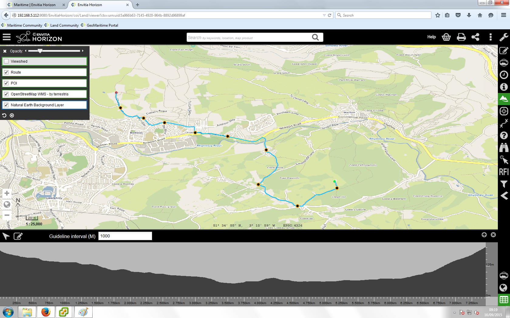

== Applications and Tools

=== Applications

A number of OWS Context Implementations exist. Initial implementors include:

==== CREAF MiraMon Client

The Centre de Recerca Ecològica i Aplicacions Forestals (CREAF) in Spain has developed a generic client (MiraMon) used for research purposes which is able to read and write OWS Context Documents using the Atom Encoding. This client supports the OWS Context Core and the WMS and WMTS Extensions. 

image::images/Figure6_1.png[]

*Figure 5.1 CREAF MiraMon Client*

For more details of the MiraMon client see: http://www.creaf.uab.es/MiraMon/

==== Compusult

Compusult have added support for OWS Context within their Web Enterprise Suite product line. This includes cataloging, reading and writing OWS Context Documents.

==== Envitia Ltd/Envitia Inc

Envitia, a UK/US SME operating in the Defence and Intelligence space has implemented support for OWS Context within many of its products. 

===== Envitia Horizon GeoPortal

Envitia Horizon supports both the ATOM/XML encoding and Draft GeoJSON Encoding of OWS Context. This is a browser based client) using JavaScript/HTML5 with supporting Java Services. Horizon supports the OWS Context core, the WMS, WMTS, WFS, GML and GeoTIFF extensions. It is also, in prototype form able to support WCS and WPS. All of these extensions are available on both ATOM XML and GeoJSON.

*Figure 5.1 Envitia Horizon Browser Client*

Envitia Horizon is being used, together with other Envitia and Open Source software in the UK Defence Geographic Services system a major UK Defence infrastructure programme being delivered to UK MOD by Hewlett Packard.  

===== Envitia MapLink Pro

Envitia MapLink Pro is a C++ based developer toolkit, available on Windows, Linux and Android which includes an OWS Context SDK capable of reading and writing OWS Context Documents. By default it supports WMS, WMTS and GML but supports the capability to read/write any OWS Context Offering. It can be seen below displaying an OWS Context Document on an Android Tablet.

image::images/Figure6_4.png[]
*Figure 5.4 Envitia MapLink Pro Android Client*

==== ESRI

ESRI are developing capability based on the GeoJSON encoding of OWS Context, including supporting services such as WMS as well as the ESRI GeoServices REST model. 

==== TerraDue 

OWS Context Documents are being used by TerraDue in the platforms being developed for ESA. All the thematic apps are defined using OWS Context documents. See 
https://hydrology-tep.eo.esa.int/#!thematic] for more information.

image::images/Figure6_5.png[]
*Figure 5.5 TerraDue Implementation for ESA*

image::images/Figure6_6.png[]
*Figure 5.6 TerraDue Implementation for ESA*

Use of OWS Context is also being extended to the Geo-Hazard TEP area (https://geohazards-tep.eo.esa.int/) and Urban TEP (https://urban-tep.eo.esa.int/)

==== European Satellite Centre

The European Satellite Centre is using the OWS Context Document to describe collections of imagery relevant to a given scenario or situation. For more information contact the Chief Technology Officer at SATCEN https://www.satcen.europa.eu/

=== Tools

==== OGC CITE Test Validator for OWC Atom/XML Encoding 

The OGC CITE test program includes the ability to validate an ATOM/XML OWS Context document. 

The tests partially test the following requirements classes defined in the OWS Context Atom Encoding Standard (OGC 12-08r2):

* Requirement: http://www.opengis.net/spec/owc-atom/1.0/req/core
* Requirement: http://www.opengis.net/spec/owc-atom/1.0/req/atomRules
* Requirement: http://www.opengis.net/spec/owc-atom/1.0/req/owcEncoding
* Requirement: http://www.opengis.net/spec/owc-atom/1.0/req/wms/content

At present the validator only tests the OWS Context Core requirement class and the WMS Offering requirement class. 

Details of the OWS Context tests can be found at: 

http://cite.opengeospatial.org/teamengine/

==== OWS Context Atom/XML to GeoJSON Converter

Within The OGC Testbed program, a prototype OWS Context to ATOM/XML to GeoJSON converter was developed. These scripts can be executed using any XSLT 2.0 parser and are available at:

http://cite.opengeospatial.org/te2/

The main script takes an ATOM/XML document and generates a valid GeoJSON encoded version. 

